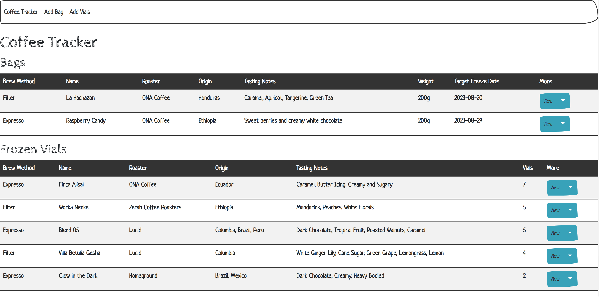
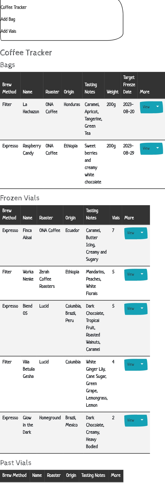
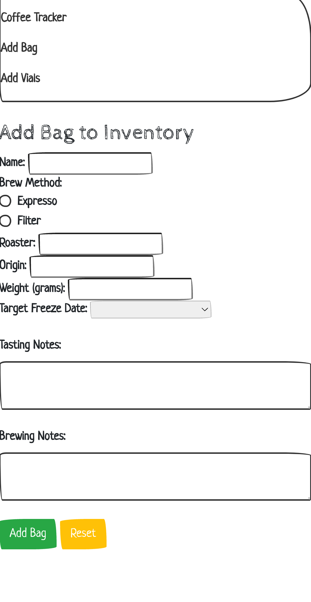
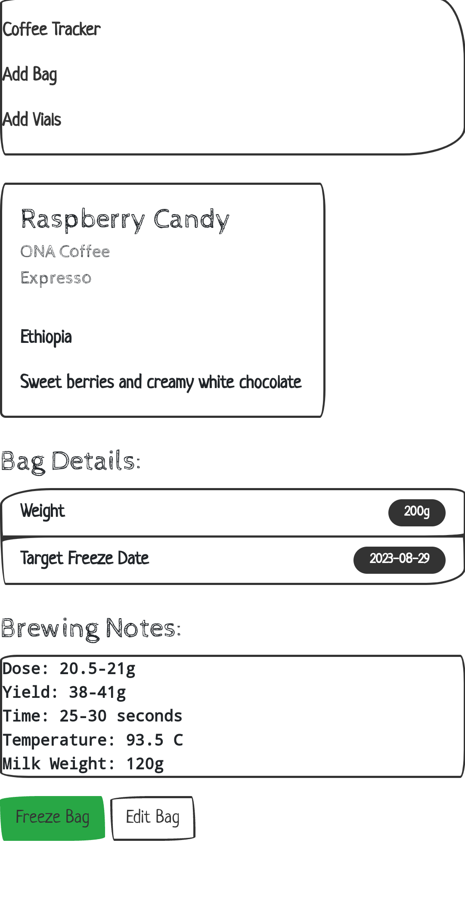
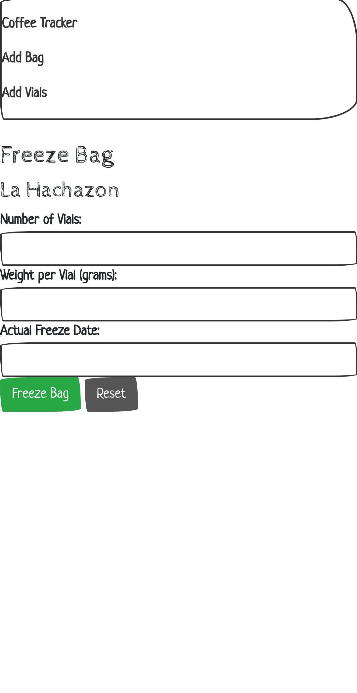

# Coffee Inventory Tracker

Coffee Inventory Tracker is a web application for keeping track of one's coffee bean inventory. I created this to keep track of my personal coffee bean inventory. It tracks beans from end-to-end: Resting in bags -> Freezing in dosed-vials -> Consumption. This project uses Flask, SQLAlchemy, and Bootstrap

## Features

- Home page with tables displaying unfrozen coffee bags, frozen vials, and past beans that have run out
- Pages to add, view, and edit new bags or vials
- Buttons to freeze bags, undo freezes, and consume vials

## Samples



<p float="left">
  
  
   
  
</p>

## Installation

Note: This was developed to run within a local network, there is no authentication and it runs as a development server

### Docker Compose

1. Create a folder to use as a volume that stores the database
2. Add the following code block to your existing docker-compose.yml

```YAML
coffee-tracker:
  image: pakshuang/coffee-tracker:latest
  container_name: coffee-tracker
  ports:
    - "5000:5000"
  environment:
    WEBSITE_NAME: Coffee Tracker
    PORT: 5000
  volumes:
    - ${DOCKERCONFDIR}/coffee-tracker:/instance
  restart: 'unless-stopped'
```

### Docker

Pull the image then run the container:

```bash
docker pull pakshuang/coffee-tracker
docker run -p 5000:5000 -d coffee-tracker
```

Append `--env WEBSITE_NAME="Your Website Name" --env PORT=5000` to the `run` command to override the default website name and/or port

### Pipenv

1. Clone this repo
2. If you want to override the default website name and/port port, create a `.env` file (see `.env-example`)
3. Run the app:

```bash
pipenv run python app.py
```